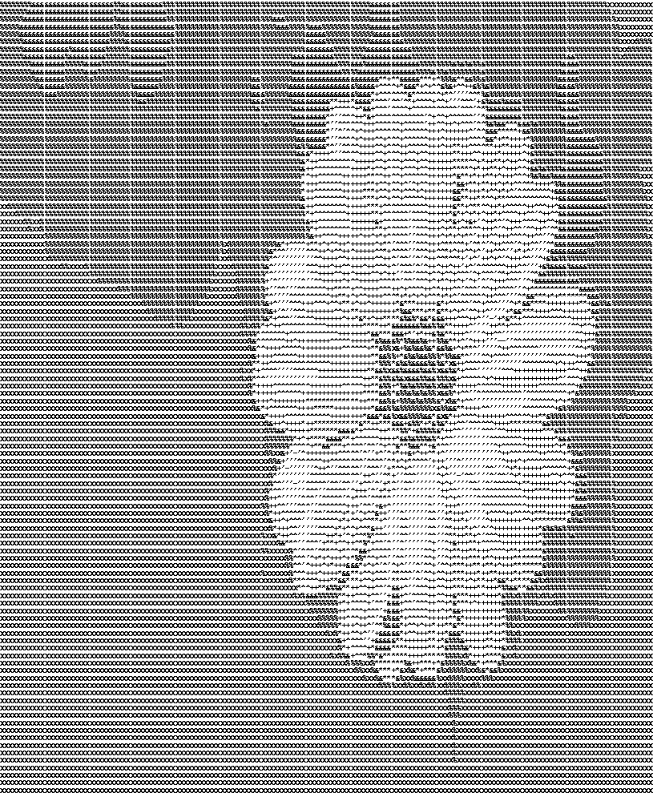

# Image-ASCII-Art-Converter

This Python script provides tools to convert images to ASCII text representations and then back into an image.




## Features

- Converts images of various formats (JPG, PNG, etc.) into ASCII art.
- Customizable scaling factor to control the level of detail in the ASCII representation.
- Reconstructs an image from an ASCII text file.
- Adjustable target width and height for the final image output.

## Installation

**Prerequisites:**

- Python 3.x

**Installation:**

1. Clone this repository.
2. Install the required dependencies:

   ```bash
   pip install -r requirements.txt
   ```

## Usage

1. Clone this repository.
2. Run the script:
   ```bash
   python Image_to_Ascii_to_Image.py -f <input_image> -o <output_image> -s <ascii_scale>
   ```
   - -f <input_image>: (Required) Path to your input image.
   - -o <output_image>: (Optional) Name for the output image. Defaults to "content.png."
   - -s <ascii_scale>: (Optional) Scaling factor for the ASCII conversion. Defaults to 5.

## Example

1. Image Input: [Upload a sample image]
2. ASCII Output: [Paste the resulting ASCII art]
3. Reconstructed Image: [Upload the output image]

## Contributing

We welcome contributions! Feel free to open issues or submit pull requests.

## License

This project is licensed under the [MIT License](LICENSE) - see the LICENSE file for details.
